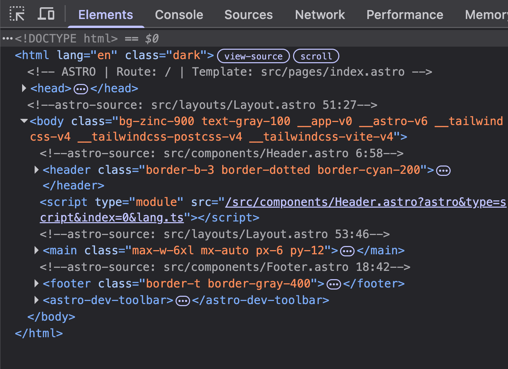

# Astro Show Route, Template, and Components

[](https://github.com/danny-englander/astro-show-route-template-components/actions/workflows/ci.yml)

I was inspired to create this project as I have a Drupal background and I really like Twig template debug output. This project pays homage to that and I find this really useful.

This is a dev-only Astro integration that injects HTML comments showing which route, template, and astro components are being used on any given page.



## Why

Two complementary debugging layers:

1. **Route & templates** — one comment per page after `<html>`, visible in View Source:
   ```html
   <!-- ASTRO | Route: /blog/foo | Template: src/pages/blog/[slug].astro -->
   ```

2. **Components** — a comment above each rendered node, visible in the Elements panel:
   ```html
   <!-- astro-source: src/components/Footer.astro 12:4 -->
   <footer>...</footer>
   ```

Component comments persist after the Audit dev toolbar strips `data-astro-source-*` attributes. DOM nodes stay uncluttered.

## Requirements

- Astro 4+
- Dev toolbar enabled for component comments (source attributes are only emitted when the dev toolbar is active)

## Install

```bash
npm install -D astro-show-route-template-components
```

## Usage

```js
// astro.config.mjs
import { defineConfig } from "astro/config";
import showRouteTemplateComponents from "astro-show-route-template-components";

export default defineConfig({
  integrations: [showRouteTemplateComponents()],
});
```

Both route and component comments are enabled by default. No layout changes required.

## Options

```js
showRouteTemplateComponents({
  enabled: true,
  routes: true,
  components: true,
  routePrefix: "ASTRO",
  componentPrefix: "astro-source",
  srcDir: "src",
  includeLoc: true,
  pathMarkers: ["/src/", "/node_modules/"],
});
```

| Option | Default | Description |
|--------|---------|-------------|
| `enabled` | `true` | Turn off without removing the integration |
| `routes` | `true` | Inject route/template comment after `<html>` |
| `components` | `true` | Inject per-component source comments |
| `routePrefix` | `"ASTRO"` | Prefix in route comments. `prefix` is an alias. |
| `componentPrefix` | `"astro-source"` | Prefix in component comments |
| `srcDir` | `"src"` | Root folder for repo-relative route paths |
| `includeLoc` | `true` | Append `line:col` to component comments |
| `pathMarkers` | `["/src/", "/node_modules/"]` | Markers used to shorten component file paths |

Disable one layer if you only need the other:

```js
showRouteTemplateComponents({ components: false }); // route comments only
showRouteTemplateComponents({ routes: false });     // component comments only
```

## Local development

```json
{
  "devDependencies": {
    "astro-show-route-template-components": "file:./astro-show-route-template-components"
  }
}
```

## License

MIT
